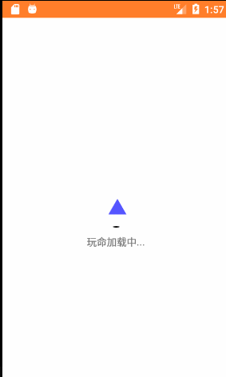
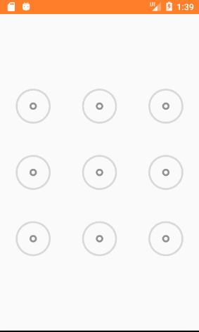
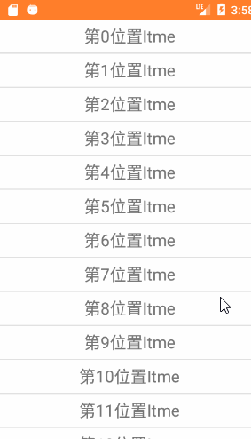
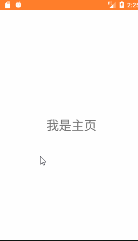
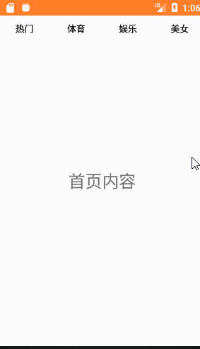
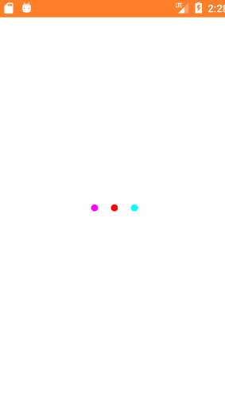
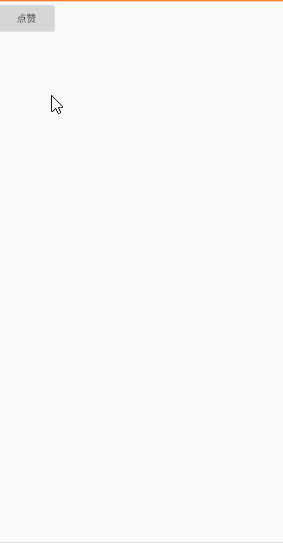
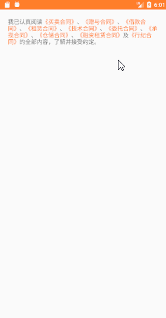
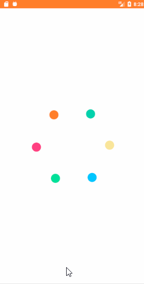

# TeaTool

自定义view练手，手写源码、开源框架

## [手写实现Handler](app/src/main/java/com/tea/teatool/teahandler)

## [手写实现ButterKnife](app/src/main/java/com/tea/teatool/teabutterknife)

## [手写实现EventBus](app/src/main/java/com/tea/teatool/teaeventbus)

## OkHttp相关

## [防OkHttp造轮子](app/src/main/java/com/tea/teahttp/TeaHttpActivity)

## [OkHttp文件上传](app/src/main/java/com/tea/teahttp/TeaOkUpFileActivity)

## [手写IOC注解](app/src/main/java/com/tea/teatool/iocannotate)

## [h5商城](app/src/main/java/com/tea/teatool/webshop)

## [手写TextView](app/src/main/java/com/tea/teatool/teatextview)

## [自定义键盘](app/src/main/java/com/tea/teatool/keyboard)

## [自定义流式布局](app/src/main/java/com/tea/teatool/flow)

## [自定义圆弧加载](app/src/main/java/com/tea/teatool/arcspeed)

## [自定义文字变色](app/src/main/java/com/tea/teatool/cliptext)

## [自定义星星评分](app/src/main/java/com/tea/teatool/tearatingbar)

## [自定义字母索引](app/src/main/java/com/tea/teatool/letterindex)

## [自定义图形变化加载](app/src/main/java/com/tea/teatool/loadingshape)

## [自定义九宫格解锁](app/src/main/java/com/tea/teatool/mazelock)

## [自定义列表的下拉抽屉](app/src/main/java/com/tea/teatool/verticaldrag)

## [自定义侧滑菜单](app/src/main/java/com/tea/teatool/slidingmenu)

## [自定义tab菜单筛选](app/src/main/java/com/tea/teatool/tabmenu)

## [自定义三圆点加载](app/src/main/java/com/tea/teatool/circleload)

## [自定义心心点赞](app/src/main/java/com/tea/teatool/thumbup)

## [自定义引导页视差动画](app/src/main/java/com/tea/teatool/parallax)

## [spannable部分文字多个点击事件](app/src/main/java/com/tea/teatool/spanclick)

## [js相互传参](app/src/main/java/com/tea/teatool/jsconnect)

## [自定义小球旋转加载动画](app/src/main/java/com/tea/teatool/loadingball)

